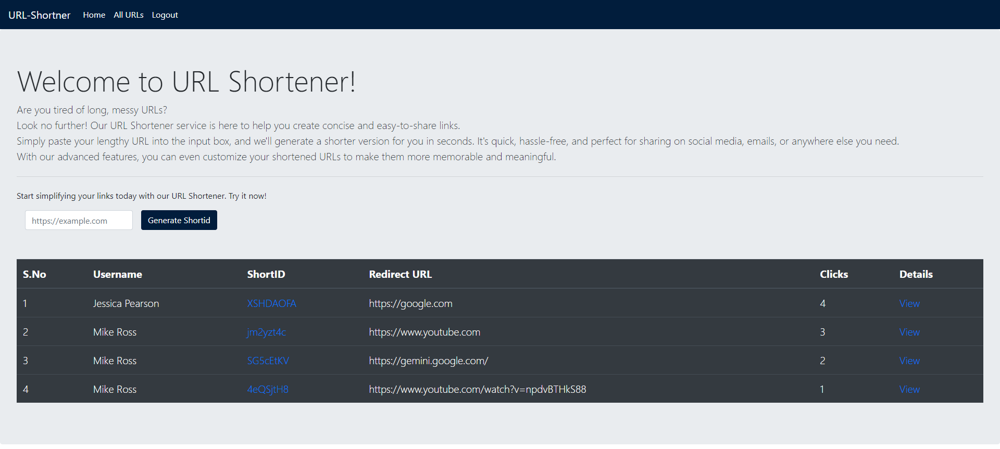

# URL Shortner

Welcome to URL Shortener!

Our URL Shortener service is here to help you create concise and easy-to-share links.
Simply paste your lengthy URL into the input box, and we'll generate a shorter version for you in seconds. It's quick, hassle-free, and perfect for sharing on social media, emails, or anywhere else you need.
With our advanced features, you can even customize your shortened URLs to make them more memorable and meaningful.


## Demo




## Environment Variables

To run this project, you will need to add the following environment variables to your .env file

`MONGO_URI` = `mongodb+srv://<username>:<password>@cluster0.hjk9sp3.mongodb.net/url-shortner`

`JWT_SECRET` = `Secret`


## Authors

- [@lalit-kr](https://www.github.com/lalit-kr)

### Contributors
- [@jyzib](https://www.github.com/jyzib)

## Tech Stack

```
Client: EJS

Server: Node, Express, Cookie Parser, Bcrypt, JSON Web Token(JWT), Mongoose
```

## 🚀 About Me
Experienced Back-end Developer with 2 years of industry expertise in Node.js and
JavaScript, adept at crafting efficient solutions in dynamic environments. Dedicated
to innovation and continuous learning, I deliver high-performance web applications
to fuel business growth.


## Contributing

### Contributions are always welcome!

First of all, please like the repo :)

Second: Fork this repo and clone it in your local system

Third: Create a new branch with the new features that you have worked on.

Finally: Make a pull reuest.

Please adhere to this project's `code of conduct`.

